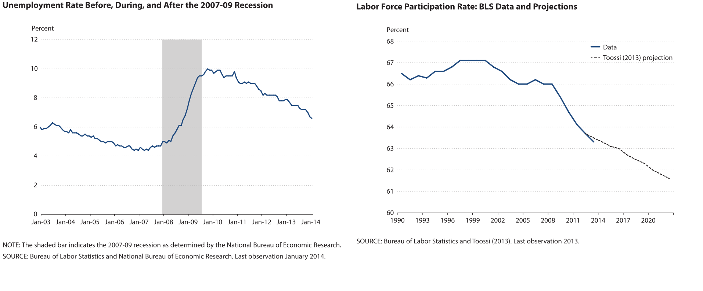

```{r setup, include = FALSE}
knitr::opts_chunk$set(echo = FALSE)
knitr::opts_knit$set(root.dir = "C:/RajuPC/MPP Final Thesis/WorkingDirectory")

source("source.R")
```

\pagebreak

#Acknowledgement:

_**write once everything is written**_

\pagebreak

#Abstract:

_**write once everything is written**_

\pagebreak

#Executive Summary:

\pagebreak

_"The economy, as an issue, is one of consensus. All voters want a good economy, no voters want a bad economy. No distribution of opinion occurs. Everyone values prosperity. When they see prosperity, they vote for the ruling party, otherwise not."_  
- @Lewis-Beck2011

#Introduction:

_**give basic intro**_

_**point out the two main questions of research**_
Two main questions:
We start by analyzing the question from a party-perspective and then move to a specific candidate, in this case being Donald Trump....  
- Do county-level economic conditions influence presidential election results in the US? - effect on specific party vote share.    
- Did county-level economic conditions play a role in the victory for the Republican party in 2016 elections (i.e. the victory of Donald Trump) and what can they say about Trump- specific effects (Does this show that Trump was a generic Republican or not)?    

_**outline section-by-section details**_  

\pagebreak

#Literature Review:

In the literature review section, I discuss various authors, theories, and analysis used in the past on topics pertaining to the research that I am conducting in this paper. Discussing the similarities and differences that occur among authors and the evolution of various theories and techniques will help me design my research hypothesis and the methods I choose. The first section of the literature review discusses economic voting theory, which is the main driver for the analysis in this paper. I choose important dependent and independent variables for my research based on the theories discussed under this section. The second section compares macro-level analysis of economic voting with micro-level analysis. I choose the geographical unit of analysis for my research based on the discussion under this section. The third section discusses the importance of various political and demographic factors that complement a good economic voting model and hence help me choose my control variables. The fourth section discusses various theories that could be attributed as factors contributing to the dominance of the Republican party in the 2016 U.S. Presidential election. The reason these theories deserve a separate section and are not included in the first section is to separate them from the traditional model and to create a premise for their exploration when analyzing the 2016 election separately. The theories mentioned here come from both academic as well as non-academic sources, since academic literature is limited in its exploratory power for an election that occured very recently and with many peculiarities that made its forecasting extremely difficult. The fifth section compares the techniques used by authors in the past, the timeframe of their analysis and other nuances.

##Economic Voting Theory:

The effect of economic factors on election outcomes has been widely studied by scholars all around the world and makes the basis for economic voting theory. When it comes to the United States, this idea of economic voting has been explored time and again through various types of statistical analysis carried out over the period of many election years. @Ebeid2006a mentions several authors, such as Gerald H. Kramer, Ray Fair, Edwards Tufte, Steve J. Rosenstone, Douglas A. Hibbs, Robert S. Erikson and Thomas M. Holbrook, who have studied and shown the connection between national macro-economic conditions and election outcomes in the United States for decades now. The macro-economic variables that are widely used to determine election outcomes are economic growth, disposable income, (un)employment, job growth, economic volatility, inflation, etc. [@Jensen2016]. Even in the area of election forecasting, which deals with predicting the future than analyzing the past, fundamental statistical models are widely used to determine election outcomes. These fundamental models also follow economic voting theory in the sense that they use economic variables, alongside various social and political factors, to predict the outcome of an election. Like Jensen, @Lewis-beck2005 lists the many economic variables used by several authors in fundamental models-based election forecasting as: GDP growth, GNP growth, perception of personal finances, prospective personal finances, leading economic indicators, income growth, and job growth. Moreover, the realm of economic voting has been expanding rapidly over the years with new variables, definitions, and processes attached to it. Some economic voting theories view the economy as a valence issue- "issues on which no one disagrees about the desired outcomes"[@Vavreck2009, p. 22]. @Lewis-Beck2011, on the other hand, examine positional and patrimonial economic voting, where positional voting means that voters use their vote with a policy aim regardless of the incumbency and patrimonial voting means that voters' own economic status plays a role in their voting behavior. According to Kiewiet, positional voting hypothesis hasn't been empirically tested as much as the incumbency-oriented hypothesis- where an incumbent is either rewarded or punished by the voters during elections- provides strong motivation to explore Presidential elections in the U.S. from a mix of both positional and patrimonial perspective [as cited in @Lewis-Beck2011, p. 6].

The proponents of economic voting agree and disagree with each other on a few topics. Some of the main questions that still float around in the area of voting behavior were clearly laid out by @Abrams1980 in what he labeled as the three main research questions of 'political business cycle' that needed clarification:  

> \(1) to determine which politicians, if any, are held responsible by the electorate for changes in general economic conditions; (2) to identify which general economic conditions influence the electorate's voting; and (3) to establish the time period that the electorate uses to assess economic policies. (p. 1) 

The first two questions asked by Abrams set the stage to determine which indicator captures the election result (dependent variable) and which economic variables explain it (independent variables). To answer the first question regarding the basis for measuring the election result, one may choose to look at the total vote share of the incumbent or the total vote share of a specific party or the two-party vote share of a specific party. The idea of choosing the total vote share of the incumbent is embedded in one of the assumptions of the economic voting theory that claims that voters reward or punish the incumbent party or its candidates. Tuftes's "election-as-a-referendum-on-the-government" idea has been used to incorporate incumbency in forecasting models to predict U.S. Presidential elections [as cited in @Lewis-beck2005, p. 150]. Moreover, @Norpoth2010's "cost of ruling" designation to incumbency showcases the effects that incumbency can have when it comes to German elections. They both use incumbent vote share as a dependent variable, and attribute this to the party's vote share, without elaborating if the resuts would be different if the candidate is incumbent as well. While most studies place candidates and parties under the same umbrella, @Eisenberg2004 separate the two entities and claim that voters do not hold incumbent candidates "additionally"" accountable even though they hold incumbent parties responsible. In doing so, they refute previous claims that economic voting is more significant for incumbent candidates than for incumbent parties with new candidates[@Eisenberg2004]. Another way of measuring the election result is by looking into a specific party than the incumbent party. The rationale behind this approach is to understand if voters "always" assign their economic vote for or against the incumbent or if they do so based on a specific party, regardless of the incumbency. This happens under issue-priority theory, where voters relate certain economic policies with certain parties and vote for the party that is concerned with solving that issue even if the country is not performing so well under that party in that particular issue [@Kim2003]. In this paper, we will follow Kim's theory in analyzing if voters in the United States take certain economic indicators into account when voting for the Republican party. We, will nevertheless, keep incumbency as a dummy control variable to check if it has any conditional effect. Meaning, while voters may vote based on certain policy issues, the effect of their examination of the policy on the vote share may be dependent on whether the party is an incumbent or not. The purpose of the paper is to see from the perspective of not just a voter but a Republican voter.

The second question by Abrams is already touched upon above by listing a plethora of explanatory economic variables mentioned by various authors as indicative of election outcome. While all of them have their merits, depending on the nature of analysis, unemployment is the one that stick out specifically in the context of this paper. @Wright2012, while describing the theory of issue-ownership, claims that the most central problem that voters keep in mind to make their election decisions is whether they, their families, friends, and neighbors have jobs or not. Unemployment is also a variable that is more relatable among voters who may find it difficult to assess the performance of the government based on other complex economic indicators. Similarly, seeing the rise of globalization all over the world and its impact on the economy, @Jensen2016 claim that trade contains information that growth and employment do not explain and hence include macro-economic indicator such as U.S. trade balance as an explanatory variable for national-level voting.

The third question by Abrams which discusses about the time frame of different variables will be discussed under the fourth section of the literature review.

##Macro-level analysis vs Regional Analysis (A Case for Counties):

Study of voting behavior has usually consisted of analysis at the national level as scholars have tried to connect national economic indicators to election outcomes. Even individual level surveys such as the American National Election Survey (ANES) ask questions regarding national economic conditions to make generalized inferences about voting behavior. One of the pros of national level analysis is that it is easy to carry out by removing many nuances of geographical differences across different subnational levels. For example, it is easy to attribute the change in national unemployment rate to the victory of a specific political party. However, the same easiness also presents itself as a big impediment to understand the real reasons behind an election outcome. A barely chartered territory is the subnational analysis at county level although some studies have been done at state level. O'Laughlin et al. [as cited in @Kim2003] and Owens and Wade [as cited in @Kim2003] provide some evidence of sub-national level economic voting scenario in Germany and the United Kingdom, while in terms of the United States Archer and Taylor [as cited in @Kim2003] have sought to shed some light on the role of sectionalism in American politics. @Abrams1980 presents the rationality behind the idea of testing whether state-level economic conditions are used by voters to assess presidential policies and if they influence electoral outcomes at the national level. He validates the disaggregation hypothesis - which suggests the disaggregation of the economic-conditions variables by geographical factor - and  claims that state-level economic conditions impact voting outcomes [@Abrams1980]. He  provides further evidence through a separate study of the 1992 U.S. Presidential election underlining the significance of state-level economic conditions in the defeat of George W. Bush [@Abrams1995]. While these studies do not make any claims at the county level, they do provide the basis to further disaggregate the economic-conditions variables at a more lower geographical level and study the resulting impact. Following up on Abrams' work, @Blackley1994's study of the 1992 U.S. Presidential election provides evidence that local economic conditions have significant effects on presidential voting and therefore are consistent with both the self-interest and local altruism hypothesis. Meaning, voters are concerned about their issues and the issues of people around them, i.e. neighbors, friends, and residents of same geographical areas. Moreover, what is considered as the self-interest of an individual can often encompass the welfare of others [@Economist1998] since people's welfares are deeply intertwined in today's vibrant and complex economy. Besides, it is safe to assume that such self interest is stronger at a smaller geographical level than at a national level where connection between individuals is much more complex and much less tangible.

The voteshare of an incumbent presidential candidate in a state is regressed against the general economic conditions of the state, which can be measured by the change in a state's unemployment rate and the percentage changes in real per capita personal income [@Abrams1980]. He claims that voters hold presidents accountable for changes in state-level economic conditions therefore cutting certain programs in strongly dominated states and moving them to closely contested states may improve the chances of reelection for the incumbent [@Abrams1980]. He also claims that abolishing the electoral college and permitting popular votes to determine presidential outcomes can outweigh the efforts of such state-level redistributive policy [@Abrams1980]. This state-level analysis from Abrams also provides a strong theoretical foundation to carry a county-level analysis. @Sartorius2015 claims that the large number of observations available from more than 3000 counties of the United States and their unique economic and electoral characteristics make for an intriguing analysis of voting behavior at a subnational level. In addition to this, @Kim2003 further argue on behalf of county-level analysis by saying, 

> not only is the problem of ecological fallacy much less severe with county-level than state-level data, but from a practical standpoint, the county may be the smallest spatial unit of analysis for testing the partisanship thesis that requires the availability of macroeconomic variables such as unemployment rate. (p. 744)   

The electoral college phenomenon that exists in the United States and the effects of gerrymandering in allowing various counties to exert a bigger weight on the outcome of the Presidential election also suggest that studying elections from county level perspective can shed light on many questions that have been answered unsatisfactorily in the past with a general national level analysis. @Kim2003 go a step further in their analysis of the effect of spatial patterns in American politics by suggesting that increasing concentrations of geographical support for the parties will mean more ideological polarization and more demographic distinction between them. Their analysis seems nothing less than prophetic in the aftermath of the 2016 Presidential election that saw an extremely polarized and divided America fall into the spatial crevaces of electoral college system. @Jensen2016 also use U.S. county level measures of economic indicator, such as employment, in order to assess the effect of trade on presidential voting. A study by @Wright2012 uses county-level employment data to claim that Democratic vote share at gubernatorial and presidential elections is directly proportional to unemployment rate regardless of the incumbency. All these studies provide a perfect premise for this paper as it aims to understand the effects of the regional economic condition on election outcomes in the past and more specifically on the recent presidential election of 2016. This paper also follows the framework by @Eisenberg2004 who claim to present "the first county-level analysis of economic voting in presidential elections." The difference in this paper, however, is that I aim to first analyze the effect of county-level economic conditions on presidential election results from the past (1992 to 2012) and then carry a separate analysis for the 2016 presidential election to explain the residual that is not covered by the first analysis. This type of county-level analysis will first test my hypothesis with the assumption that the Republican candidate is a generic Republican and secondly test if Trump is a generic Republican based on how the 2016 result fits into the model from previous years. 

##Political and Demographic Controls:
While the first aim of the paper is to analyze the impact of economic voting on Republican voteshare, controlling for other political and demographic factors is extremely important in order to find the accurate estimation of the effect. Elections are not one dimensional phenomenon and voting behavior is influenced by a multitude of factors. In the United States, one of the important factors that stands out is partisanship driven by party identification [@Campbell1960]. States are known for their identity as red, blue, or swing. And the political identity of majority of voters in those states usually stays the same over time. To analyze what affects Republican vote share in a blue parish in Louisiana (parish is the equivalent of county in Louisiana) without taking into account the party identification or partisanship indicator of that county will be erroneous. In surveys, individual voters are asked about their party preferences, but we do not have the luxury to assign these preferences to a whole county. Therefore, in this paper, the previous vote share of the Republican party is used as a measuring yardstick of the party identification of each specific county. Based on the previous voting numbers of a county, we can get an idea about the actual preference of the majority of voters in that county or atleast understand what percent of people in a county voted a certain way and what that means. The purpose of this paper is not to verify or repudiate the party identification theory but to simply control for it in order to achieve the best estimates of the effect of economic indicator. Previous vote share for the incumbent party is introduced as an independent variable by @Abrams1980 in his model. @Glaeser2006 debunks the myth that America's political geography has been more stable than in the past by claiming that it has always been quite stable as suggested by the high correlation between the current and lagged vote share of the major parties. In one example, @Kayser2011 claim that in the event of strong partisan effects (i.e. when voters are strongly tied to a particular party), the effect of the government's performance (i.e. its economic performance) has little effect on vote shares.

Although, this paper will analyze economic voting from the persepective of the Republican party and not from the perspective of an incumbent party, it is extremely important to control for incumbency effect. Many political scientists have agreed to the idea of analyzing the economic vote through the perspective of an incumbent. The main idea behind this is that voters assess the performance of the incumbent party or candidate and use their vote as a means to determine either to reelect them or not. Key's retrospective model uses bounded rationality theory to claim that voters use their vote as either a reward or a punishment depending on how the incumbent government performed [as cited in @Kim2003]. In economic voting, incumbents are given utmost importance because people often relate economic performance with the incumbent party or candidate. Hence, if the economy is doing well, it is believed to help the incumbent party or candidate and if it is doing bad it is believed to hurt them. With an incumbent dummy we can control for the effect of the incumbency on the voteshare of a specific party. Moreover, at a county-level analysis, where most variables are at county-level, the incumbency variable serves as a representative of the national effect on the county, since the incumbent candidate or party is the same all over the nation for all counties.

Demographic controls are also an important aspect of economic voting model, as they are known to significantly impact the vote share of a party at presidential elections. Including them into the model will reduce the possibility of omitted variable bias and gives more precise estimations. Race, age, education, gender are some of the main demographic variables often used by authors. Republican voters are often characterized as white and following @Campbell1960's "group interests" dimension of party ID, one can hypothesize that counties with majority whites vote Republican, making it a strong control variable. Counties with population that has fewer years of formal education can also be controlled for the understanding of the republican vote share. Gender, although being a strong control variable at national level analysis, doesn't fit a county level analysis very well. In a county level analysis, the role of gender on voteshare is difficult to measure since most counties will have around the same number of men and women and it is diffifcult to assess the effect the one gender on the vote share unless an individual survey-type analysis is done. Rurality of a county is an important control that is indicative of a plethora of characteristics about the voters. Rural voters are usually considered to be poor, uneducated, and more conservative due to the lack of dynamism and exposure that voters in urban areas experience. The effect of religion and the perception about immigration can also be different in rural and urban areas. When doing a subnational level analysis, this measure of rurality captures a lot of voting characteristics of a county, which this paper aims to explore. @Galbraith2008 in his state-level analysis claims that a high proportion of people living in urban areas, and higher minority population are associated with a greater Democratic vote.  

##Some theories for 2016 United States presidential election outcome:

The United States presidential election of 2016 has stood out for many reasons- the most significant of them being the failure of scientific forecasts and political pundits to accurately predict the winner. With years of research, theories, and models at their disposal, how did they fail to get it right is a question which still hasn't been convincingly answered even months after the election. This paper does not claim to answer it either, but does aim to incorporate some new voting theories that have been floating around and see if and how they might have played a role. There are a multitude of rival theories on what might have influenced the 2016 election: economy, racism, sexism, Russian influence, anti-elite message from a supposedly non-political candidate, social media's impact- be it via fake news or late-swing generating tweets from influencing people, resentment from Bernie Sanders' supporters, shaming of the Republican voters by liberal elites, third-party effects, gerrymandering, and the list goes on and on. Considering the limitation on the scope of this paper, which focuses on county-level analysis and hence requires county-level data to do so, I will touch upon only a few of these theories and test them using a statistical model. Through elimination of one or two of these theories via a scientific analysis at a subnational level, we could get one step closer to finding out what may have actually happened.

The first theory that I aim to test is what I will call the "employment theory"[^14], which focuses on employment rather than unemployment. The underlying idea behind this theory is the impact of globalization on workers from sectors that have suffered the most due to changing economic dynamic. @Jensen2016 claim that the traditional measures such as unemployment and economic growth alone do not fully capture the effect of trade (by which they mean globalization) on workers' voting behavior. In their county level analysis they measure employment in firms that have been affected by trade liberalization and in doing so they introduce variable to measure employment in manufacturing and service sector [@Jensen2016]. In this paper, I will introduce a similar variable that will measure the change in the proportion of manufacturing jobs since the last election. The reason the change is measured in relation to the last election is embedded in the assumption that voters view the situation they are facing during this election with the situation they were facing at approximately the same time during the last election, explaining the change in their voting behavior from the last time. _cite this_ Another variable that I found extremely relevant in understanding the 2016 election is the labor force participation rate. According to the Bureau of Labor Statistics (BLS), "the labor force participation rate is the percentage of the population that is either employed or unemployed (that is, either working or actively seeking work)."[^15] The importance of this variable lies in the fact that there are many people in their prime working age who may not be participating in the labor force and hence reflecting certain peculiarities about the economy and its effect on them that could be translated into their voting behavior. A simple measure of unemployment rate doesn't capture what the labor force participation rate does, meaning a county with fairly low unemployment rate could be suffering from a low labor force participation rate as well. This is well evident in the example presented by the BLS in 2007 where the unemployment rate between July and August didn't change much despite a decline in the labor force participation by about 600,000 people [as cited in @Gustavsson2014]. This led me to include labor force participation rate as one of the variables to describe Republican vote share in the 2016 election. I base this on the recommendation made by @Gustavsson2014 who suggest using other labor market statistics before drawing any inferences about the labor market conditions and we have established before that these conditions play an extremely important role in voting behavior. Back in 2010 they claimed that "there are important, permanent, discouraged-worker effects among males in the US economy" and suggested that measures such as employment rate or some other measure includes groups suspected of being discouraged workers in addition to the ones unemployed [@Gustavsson2014]. Following up on the work of Gustavsson and Österholm, @Liu2014 argue that unemployment alone cannot explain the economic condition of a region and therefore region-specific employment policy should be driven in such a way so that the discouraged workers are brought back into the labor force. 


Source: [@Bullard2014]

The second theory that I aim to test for the 2016 election result is what I will call the "wage theory".[^16] @Jensen2016 use average pay of the workers during the election year as an important regressor for the incumbent vote share. More importantly they include it in their county-level analysis. Voters are expected to reward the incumbent in the event of higher average wage. Following up on the same idea, I aim to include the change in average pay between the 2016 and the 2012 election. The change seems more logical than the absolute value as it can capture the difference in economic condition between two election years and hence help us explain the change in Republican vote share. The fact that wages for the poor have stagnated for many years could explain the frustration among voters and hence its expression through their votes.[^17] Grossman and Rossi-Hansberg, for instance, claim that in addition to the loss of many jobs that occurs due to offshoring, it also suppresses wages of certain low-skilled sectors in a large economy like the United States [as cited in @Margalit2011]. @Charles2013 also study the effect of local wages on voter turnout and analyze if they hold any effect on elections at diferent level in the United States.  

The third theory is the "inequality theory,"[^27] which can help understand if the growing inequality in the US has any explanatory power when it comes to voting behavior. Afterall, Bernie Sanders' whole campaign was based on reducing the inequality in the U.S. and expanding the middle class, and it was able to garner immense support among young voters and Democratic states with majority white population. A report by World Economic Forum has also attributed the victory of Donald Trump and Brexit outcome to rising inequality.[^18] Schneider-Petsinger (2016) [^19] claimed that inequality would be the largest concern among voters in the 2016 election and that 52 percent of Americans underline the gap between the rich and the poor being a very big problem. Darvas and Efstathiou carry out a scientific analysis showing income inequality had a positive and statistically significant effect on Trump's victory in the election, meaning that more unequal states were more likely to vote for him.[^20] Their analysis and results provided with the necessary motivation to test the findings at a county level. @Mughan2002 note growing inequality as one of the important factors to look into when assessing voting behavior in the United States. Moreover, @Partridge1998 study the causes behind income inequality in different regions in the United States and connect them, albiet superficially, to voting behavior and policy implications. Their studies motivate the inclusion of this variable into my model. 

The fourth and one of the most important theories is non-economic in nature. I call this the "education theory"[^21] and it claims that the election outcome was influenced by difference in education level among the voters. The education theory also runs parallel to the idea that people who were less educated were more vulnerable to fake news, false economic reports, closed to diversity, and non-scientific claims made during the campaign. Assessing that relationship would take another project in itself as it would involve analyzing whether voters vote rationally or not and how much of that rationality or "correctness of vote" is depended on their education level. However, the point of this paper is not to do so. Nate Silver, one of the well-known political pundits and forecasting guru, claimed that it was in fact education and not economy that predicted who would vote for Trump.[^22] Hendrickson and Galston suppose that educational attainment can have influences on both the economic conditions and cultural positions of the voters, making it a uniquely important explanatory variable in itself.[^23] Caplan explains that congressional districts with higher educational achievements would support economic arguments such as free trade and comparative advantage [as cited in @Georgia2004]. @McGill2016 also underlines that concentration of college degrees in a county is a strong indicator to whether the county would back Republican or not and goes further to claim that education mattered more than economy or race during the recent Presidential election. @Knuckey2015, @Kriner2012, @Franklin1983, and almost all of the authors who study economic voting have introduced educational attainment as a control in their model to explain voting behavior, hence setting the tone for its inclusion in my model. 

##Timeframe, technique, and other peculiarities:

Going back to the third question posed by @Abrams1980, it is important to understand which time period do voters have in mind when they assess the economic indicators to make decisions on their vote. Many others have answered this question by testing economic voting theory with available economic data at that specific year. With the growing influence of media on voters and information available to people instantly at their palms, one could make two contrasting claims- first, people utilize their ability to easily extract information and therefore build up on their knowledge about the economy over time, and second, people are influenced by the last minute information thrown at them and base their voting decisions on events happening around the election data. @Ebeid2006a claim that relevant academic literature operationalize real per capita income (RPCI) as a one-year growth rate, and unemployment as an absolute level or first difference when constructing economic voting models. What this means is that voters compare the economic condition of the election year to that of the previous year. @Eisenberg2004 carry out a scientific examination of each of the four years in a presidential term against vote share and conclude that the most recent year explains a vast majority of the impact of economic performance. A lot of this also depends on the availability of the data. While more recent academic papers have been able to utilize the plethora of data available via various government and private agencies to carry out in-depth analyses, past papers lack such privilege. Another factor that is worth noting is that due to the growing influence of partisan media on voters, there is a possibility that voters may not even base their preference based on actual economic performance but rather on their perception or forced perception of the economy. @DellaVigna2007 studied the effect of media bias on voting and detected the presence of Fox News Effect- that Republicans gained 0.4 to 0.7 percentage points in the towns that broadcast Fox News. Candidates on both sides use the media to put strong emphasis on campaigns, advertisements, conventions, debates, controversies, all with the hope of generating a late swing in their favor. This suggests that the absolute or relative, or actual or perceived, economic effects can shape a voter's behavior much nearer to the election date. However, this is a debated topic because @Gelman1993 claim that voters cast their votes based on their "enlightened preference." They assert that although voters have incomplete information, their knowledge does get expanded over time leading up to the election day, and, throughout this period they inform themselves with the true values of the fundamental variables and their appropriate weights [@Gelman1993]. While analyzing whether people vote correctly, @Lau1997 place "correct" voting as a middle ground between individual choice and social choice and therefore define it as the individual choice made under conditions of full information. They also conclude, through their analysis of U.S. presidential elections, that most of time citizens do vote correctly. Combining Gelman's analysis with Lau and Redlawsk's gives a premise for this paper to analyze the U.S. Presidential elections through the angle of economic voting.

The types of techniques that authors use when modeling economic voting depends on many factors such as the range of the data, the variables of interest, and the research question. When analyzing cross-sectional data, pooled ordinary least squares measures are used but if the data is panel (cross sections over different time periods), one can choose between pooled ordinary least squared method, fixed effects or random effects method, depending on the specification. This paper combines three ideas- the first idea is of looking at past elections from 1992 to 2012 to see how county-level economic indicators affect Republican vote share. The use of the appropriate estimation method is explained in the methodology section. The second idea is to make a forecasting for 2016 Presidential election based on the regression estimation obtained from the first analysis of panel data. The election forecasting technique carried here is based on the fudamentals model that uses statistical estimation method and utilizes economic and sociopolitical data based on actual voting theories [@JeromeBruno2011]. The third idea is of looking at 2016 Presidential election specifically to see how much this election varies from the first model. Using the residual of the predicted and actual voteshare for 2016, I will perform another regression analysis on this residual (difference in actual and predicted vote share) with economic and other non-economic theories described in the section above. This paper is unique in its approach of combining the estimation models with a forecasting model and again coming back to the estimation of the residual with a clear research agenda of comparing Donald Trump's voteshare with voteshare of past Republican candidates, i.e. the Trump effect. 

\pagebreak

#Methodology:

This paper analyzes the research questions using quantitative regression models. The specifications of the models are based on literature review and checked for biases and perfomed robustness tests, which are included in the Appendix. _include them_   
The research question is divided into two sections: the first section studies the effect of county level unemployment rate on Republican vote share from 1992 to 2012, and the second section studies the effect of county level economic and non-economic variables on the Republican vote share of 2016 that is not explained by the model in the first part. These two researches are carried out in three steps as illustrated in the diagram below:

_Diagram_

##Step I:Understanding U.S. Presidential elections between 1992 to 2012

###Model Specification:
  
_research question should be mentioned in the intro as well already._

Research Question: What is the effect of county-level unemployment rate on the two-party vote share of the Republican party in the Presidential election between 1992 to 2012?

Hyopthesis: A growth in unemployment rate will have a negative impact on Republican vote share, since voters identify the Democratic party as the one more capable for tackling the issue of unemployment and for providing welfare and other benefits necessary in the event of high unemployment. The hypothesis is drawn from the discussion of unemployment in the literature review that presents it as a key explanatory variable of the issue-ownership theory.

###Regression Equation: 

$$rep.share_{i,t} = \alpha + \beta_1 (unemp\_gro_{i,t}) + \beta_3 (controls) + \epsilon $$

###Dependent Variable:

$rep.share_{i,t}$: The dependent variable is the two-party vote share of the Republican party in the U.S. Presidential election for county (i) in election year (t). Considering that it is not clear how the third party vote share affects any of the major parties in the United States Presidential election, I have decided to eliminate the third party vote share, as other authors have done in the past[@Eisenberg2004]. Hence, the Republican vote share shown here is the Republican proportion of the two-party vote share. For example, in Abbeville county in South Carolina in 2000 Presidential Election, Republicans obtained 53.1 percent, Democrats obtained 45 percent, and other parties obtained 1.9 percent of the votes. Therefore the value of _rep.share_ for Abbeville in 2000 will be the ratio of Republican share to the total share of Democrats and Republicans combined, i.e. 0.541. Different scholars have used different versions of this variable in their analysis. Most of them use the vote share of the incumbent party however, in this case, the research question aims to explore the effect of county level variables on the Republican party specifically. Hence, the usage of the Republican two-party vote share becomes logical.   

###Independent Variable:

$unemp\_gro_{i,t}$: The main independent variable, which is also the explanatory economic variable, is the growth in unemployment rate for county (i) between election year (t) and the preceeding year (t-1). For example, Abbeville county has an unemployment rate of 3.8 percent in 2000 and an unemployment rate of 5.7 percent in 1999. Therefore, the value of _unemp\_gro_ for Abbeville for election year 2000 will be (3.8-5.7)/5.7 = -0.33. @Ebeid2006a in their county-level analysis of voting behavior claim that in order to maintain consistency and for the ease of interpretation, unemployment and other economic variables can be operationalized using a percentage change i.e. one-year growth rates, like the one done in this case.

###Control Variables:

$repshare.lag_{i,t-4}$: The two-party vote share of the Republican party in a county (i) in the previous Presidential election (t-4) is used as a political control variable. This variable is expected to measure the party affiliation of a specific county. In the United States, many states and counties within them are known to be historically blue or red. What this means is that the voting behavior of counties are often pre-determined based on how they voted in the election before. Not accounting for this variable could cause ommitted variable bias, resulting in biased estimates for other explanatory variables, and deteriorate the explanatory power of the model by affecting the goodness of fit (i.e. R-squared). The use of this lag-dependent variable does come with some caveats depending on the estimation method and it will be discussed in the analysis section later.   

$Pop\_thou_{i,t}$: The population of a county (i) in the election year (t) is used as a demographic control variable. This variable is introduced to control for the size of the counties. The population range is extremely big with smallest counties having a few hundred people while the largest counties in millions, hence this variable gives the population of the counties in thousands.

$white.percent_{i,t}$: The percentage of white people (both male and female combined) in a county(i) in the election year(t) is used as another demographic control variable. This variable is introduced to control for race. The percentage is calculated by dividing the total number of white people above the age of 18 (since voting age in the United States is 18) in a county by the total population (all ages) of that county.

$rep\_incumb_t$: A dummy variable for incumbency is introduced as another political control variable. The value of _rep\_incumb_ is 1 for election years that had the Republican party as the incumbent and 0 for election years that had the Democratic party as the incumbent. This variable does not change for counties in a given election year and it is extremely important in analyzing the incumbent effect discussed in the literature review section above.  

$rural.percent_i$: The percentage of population living in rural areas of a county is introduced as another demographic control variable. Higher the percentage of people living in rural areas, the more rural a county is considered. This designation is based on the United States Census of 2010 that considers counties with 50 percent or more people living in rural areas as a rural county and less than 50 percent of people living in rural areas as an urban county. This variable is fixed for a given county across all years and does not appear in any Fixed Effects model, unless interacted with other variables.

###Estimation Technique:

The regression estimation technique used for the model above is a Fixed Effects Model of estimation (called FE estimation, hereafter). FE estimation is ideal here due to the presence of a panel dataset and it has been preferred over Random Effects Model of estimation after performing Hausman test (See Figure _X_ under Appendix). The FE estimation explains the 'within' county variation i.e. it explains the effect of the explanatory variables on the dependent variable for each specific county over a period of time. Time invariant fixed effects, such as the variable _rural.percent_ is not accounted for in the FE estimation, although it may be introduced as an interaction term (which will be explained in the Analysis section below). FE estimation is also justified here because we want to look at the effect of each county-specific variable on the vote share for that particular county, understanding that the counties across the United States differ from each other. A county in Texas has different characteristics than a county in California and using a FE estimation, we are able to account for those differences. This follows the framework by Stock and Watson who propose FE estimation to control for omitted variables in panel data when these variables vary across entities but not over time [as cited in @Sartorius2015]. 

##Step II: Forecasting the Republican vote share for 2016 election
In the second step, I carry out a forecasting exercise by predicting the Republican two-party vote share for 2016 using the regression equation and coefficient estimates obtained from Step I. Because of the FE estimation, the coefficient estimates remain the same for all the counties but each county will have a different intercept (constant). The purpose of the forecasting exercise is to analyze how well the model explains the election outcome of 2016. Once the forecasting is done, I plot the predicted two-party voteshare of the Republican party against their actual two-party vote share in 2016 for all the counties to obtain a residual. The residual is the difference in the votes obtained by the Republican party from what it was predicted to obtain, i.e. the share of Republican party vote share that is not explained by the model in Step I. This demands the creation of another model, which aims to explain the residual and hence the Trump effect, leading us to the second research question. 

@Lewis-beck2005 writes that forecasters revise their model specification based on trials and that one would be hard pressed to find a model that hadn't been changed at least once. This idea lays the perfect premise for me to introduce some new rival theories concerning 2016 election (which I have mentioned in the Literature review section above), operationalize them, and use them as explanatory variables in my second model. Since there are many possible variables that could be included in the new model, one must be careful in choosing the appropriate ones that are embedded in strong theory and do not have negative consequences on the model itself. I choose the variables keeping that in mind, although I am also tempted to test a few variables despite a lack of strong academic theory behind them, since the election was very recent and the failure of many forecasting models pre-election suggest that sticking to only traditional fundamental variables may not do the job. In that regard, I have followed @Lewis-beck2005's suggestion who assert that,

> with respect to model revision, I favor the KISS strategy advocated by Arnold Zellner: Keep It Sophisticatedly Simple (García-Ferrer 1998). That is, judiciously introduce one or two theoretically potent new variables (or new measures of old variables), when the cumulating evidence suggests it. (p. 155)

##Step III:

###Model Specification:

Research Question: Which theories (economic and non-economic) regarding the outcome of 2016 Presidential election, when analyzed at county-level, explain the deviation in the actual vote share for the Republican party from the predicted vote share based on a traditional model?

Hypothesis: Keeping in mind that Donald Trump's victory was unprecendented and he was touted as a non-regular candidate (i.e. different than a regular Republican), the effects of county-level variables should be different in 2016 election than the previous election. The additional variables that may have had an effect on Donald Trump's victory include the change in number of manufacturing jobs, change in average wage, income inequality, change in labor force participation rate, or level of educational attainment among voters. These variables seem to have some merit considering his campaign slogan "Make America Great Again" and his promises to raise the lives of the poor who had suffered from the wraths of globalization and the neglect of Washington. 

###Research Equation:

$$resid = \alpha + \beta_1 (manu\_share\_gro) + \beta_2 (av\_wage\_gro) + \beta_3 (lfpr\_male\_gro) + \beta_4 (gini\_gro) + \beta_5 (uneduc) + \epsilon $$

###Dependent Variable:

$resid$: The dependent variable is the difference in the actual two-party vote share of the Republican party in the 2016 United States Presidential Election from the predicted vote share based on the model in Step I of this paper. Substituting the values of different explanatory variables in equation 1, pertaining to election year 2016, we will get the value of the predicted republican vote share for each county for 2016. For example, if the predicted Republican voteshare for a county is 0.55 but the actual Republican voteshare is 0.60, then that means the _residual_ value for that county will be 0.60-0.55 = 0.05. This means that 5 percentage point increase in the Republican voteshare is not explained by the model represented by equation 1 and therefore, we would need to test a bunch of new explanatory variables, which could possibly explain this residual. A positive residual means that the Republican party outperfomed our forecasting model in those counties, a negtive residual means that the Republican party underperfomed, a value of 0 means that our forecasting model was able to accurately predict the actual voteshare of the party for 2016. The difference in using residual instead of simply voteshare for 2016, like the one used for the model in Part I, is that we are trying to measure Trump-specific effect here. Depending on how the forecasting performs and how the residual reacts to different explanatory variables in this model, we can come to conclusions on whether Trump was a generic Republican or not and which new factors played significant role in his victory.

###Variables from Rival Theories:

$manu\_share\_gro$: The first independent variable is the change in manufacturing employment. It is obtained by the difference in the ratio of manufacturing jobs to total private non-farm jobs between 2012 and 2015. An ideal measurement would have been to see the difference between 2012 and 2016, since both are election years. However, the data for 2016 is not yet available and the usage of 2015 values should not be problematic considering that the explanatory variable is a slow-changing variable. 

$av\_wage\_gro$: The second independent variable is the difference in average wage between 2012 and 2015. A positive value means that the average wage has increased in the county while a negative means that it has decreased. 

$lfpr\_male\_gro$: The third independent variable is the change in labor force participation rate among males between 2012 and 2015. Based on the theory that the demographic group that has been discouraged to participate in the labor force is mostly men, I choose the change in labor force participation rate among men in a county during the time frame @Gustavsson2014. A positive value means that more people are getting back in the labor force while a negative value means that more are being discouraged and not participating in the labor force.

$gini\_gro$: The fourth variable is the change in gini coefficient for each county between 2012 and 2015. A gini coefficient is the most widely used measure of income inequality. A gini coefficient of 1 represents maximum inequality and a gini coefficient of 0 represents no inequality. In this case we will look at the difference between these two years. A positive value indicates more inequality while a negative value indicates less inequality within the county since 2012.   

$uneduc$: The percentage of people in a county who are 25 years or older with less than high school degree in 2015 is used as a social/demographic control variable to account for the impact of education (or lack thereof). This variable is calculated by dividing the total number of people above 25 years of age with less than high school degree (i.e. less than 12 years of formal education) by the total population of that county in 2015.

###Estimation Technique

The regression estimation technique used for this model is a Ordinary Least Squares Model of estimation (called OLS estimation, hereafter). The OLS estimation is ideal here due to the presence of a cross-sectional dataset with no time-wise variation. The OLS estimation explains the average effect of the explanatory variables on the dependent variable for all the counties between 2012 and 2015. Like mentioned earlier, I do not include the same variables already used in the first model in Step I since this time we are only concerned with identifying the causes of the residual (i.e. explanatory factors additional to what had already been incorporated in the first model). More importantly, I also remove the intercept values for each county since _explain in better words_. Regards to the usage of the 2012 values instead of 2014 values, my assumption is based on the idea that voters compare the current economic situation with the one during the same time in the past election. However, I have attached regression output using with independent variable that shows changes between 2014 and 2015 in the Appendix below. _show appendix_ 

##Data sources and cleaning:

The data necessary to carry out the quantitative analysis in this paper were obtained from multiple sources and rigorously cleaned and merged together using open source software R studio to extract the variables described above. The entire paper is also written on R markdown and formatted using Latex. The dependent variable was obtained from election data that contained both Republican and Democratic vote share in Presidential elections between 1992 and 2016. The dataset came from Dave Leip's Atlas of U.S. Presidential Elections.[^2] To calculate the two-party vote share, the voteshare for Republican party was divided by the sum of vote shares for Republican and Democratic party. The lag of republican vote share used in the first part of the research was calculated based on the same election dataset. The data on unemployment from 1992 to 2015 was obtained from the Bureau of Labor Statistics (BLS).[^3] To calculate the growth in unemployment rate between two years, the unemployment rate for previous year was subtracted from the unemployment rate of the current year, and then the result was divided by the unemployment rate of the previous year. The data on population for each county from 1992 to 2015 were called from the Bureau of Economic Affairs (BEA) API directly into R studio.[^4] Data used to construct the incumbency dummy was created manually based on common knowledge and merged into the final dataframe (See Appendix to see which years had what incumbency values). _Put table on Appendix with president's name and years and dummy_ Data on rural population was obtained from the United States Census Bureau.[^5] Demographic data on educational attainment was not available for several years between 1992 and 2012, hence education related variable wasn't included in the model in the first part of the research. However, for the second part of the research, educational attainment data for 2015 was obtained from the United States Census Bureau as well.[^6] The race data that included white population in each county between 1992 to 2015 was obtained from the database of the National Cancer Institute.[^7] The counts of race and education data were converted into percentages by combining them with the population data obtained from BEA. The data on Labor Force Participation rate[^24] and Gini coefficient[^25] for 2012, _2014_, and 2015 were obtained from the United States Census Bureau. The data on manufacturing jobs, total number of private non-farm jobs, and average wage were called directly from the BEA API.[^26]   

All the dataframes were merged based on county fips (unique identification for each county assigned by the US Census Bureau). There are a total of 3142 counties (or county-equivalents) in the United States. However, due to inconsistent nomenclature of counties and county-equivalents, and the matching problem it created since many counties have been reshaped over the years, some counties were removed from the dataset. All the 29 boroughs of Alaska were removed from the final dataset due to difficulty in matching them to the county fips across multiple datasets. Maui and Kalawao counties of Hawaaii were merged together into the same county called Maui to make it consistent over multiple datasets. These processes resulted in a total of 3112 counties. The final merged panel dataset, which was used for the first part of the research, hence contained 3112 counties x 6 election years = 18672 observations. For the second part of the paper, the final cross-sectional dataframe consists of 3112 counties. _check these numbers_ _mention Virginia_

A list of all the variables and other specific details on them are available in _table X_ under the Appendix section.

\pagebreak

#Result and Analysis:

##Step I: Understanding U.S. Presidential elections between 1992 to 2012

###Descriptive Statistics: 
_FigX_ shows the how the main independent variable, the lag dependent variable and the dependent variable are correlated to one another, and therefore provide some basic understanding on how their causal relationship could turn out to be. We can see that growth in unemployment is negatively, yet not so strongly, correlated (r = -0.042) with the Republican two-party vote share. More importantly the Republican vote share in the previous election is positively, and strongly, correlated (r = 0.887) with the present voteshare. Both of these correlations are in line with the theory established earlier in the paper. The distribution plots of each of these variable show a normal distribution with no noticeable skewness for both the Republican vote share and the lag of Republican vote share. Although, the growth in unemployment shows a right-skew, _can we ignore it?_ 

```{r, warning = FALSE, message = FALSE}
print(corplot1, progress = F)
```

_FigX_ shows the correlation between the dependent variable with other control variables. Republican two-party voteshare has moderately strong, and positive, correlation with both the percentage of white people living in a county (r = 0.346) and the percentage of people living in rural areas of the county (r = 0.213). We also see a positive correlation, yet not very strong, between rural population and white population (r = 0.16), depicting the situation in the United States where most rural areas are considered to be homogenous while the urban areas are more heterogenous. It is important to note that counties with larger population have a negative correlation with Republican vote share (r = -0.201) and also show that these counties are less rural (r = -0.393) and have lower white percentage(r = -0.137). 

The distribution plot shows an extreme right skewness with population due to the presence of some extremely populous county like the Los Angeles county in California that has a population of more than 9 million. _We correct for this by taking a natural log of the population_. Similarly, the plot of rural_percent shows _a weird shape_ _why explain_. 

```{r warning = FALSE, message = FALSE}
print(corplot2, progress = F)
```

The descriptive summary table (see _figX_ under Appendix) gives a complete overview of the central tendency and the variation of all the variables.  

###Regression Output and Results:

_FigX_ shows the regression output with Fixed Effects estimate, showing the relationship between unemployment growth and other political and demographic controls for U.S. Presidential elections between 1992 and 2012. 

```{r, results='asis', warning=FALSE, message=FALSE}
stargazer::stargazer(f1, test1, f102, test102, type = 'latex', digits = 2, header = FALSE,   
                     title = 'Fixed Effects Estimate to Explain Republican two-party vote share(1992-2012)', 
                     font.size ='small', column.sep.width = "1pt")
```

Due to the inclusion of a lag dependent variable _repshare.lag_, an Arellano-Bond test is conducted to account for nickell bias _cite_. Therefore, the estimates in the fourth column, with corrected standard errors, and with all relevant control variables, are used for interpretation. Growth in unemployment has a negative effect on Republican two-party vote share high statistical significance. One percent growth in unemployment rate between the year preceeding the election and the election year will result in a fall of Republican two-party vote share by 0.02 percentage points. This result is in line with the issue-priority theory, which says that higher unemployment benefits the Democratic party. It is important to note that the effect of the growth in unemployment is obtained by controlling for the Republican vote share from previous election which shows an extremely high effect on the current vote share with high statistical significance. The estimates also show that an increase in the percentage of white people in a county increases the Republican vote share, and the effect is even stronger if we look at rural white population. 

```{r, eval = FALSE}
interplot(m = f2, var1 = "white.percent", var2 = "rural_percent") +
  xlab("Percentage of total population living in rural areas") +
  ylab("Marginal effect of the percentage of white people on Republican vote share") +
  ggtitle("Don't know what") +
  geom_hline(yintercept = 0, linetype = "dashed")

```

Validating @Norpoth2010's cost of ruling theory, the incumbency factor shows that if the incumbent is a Republican, then the Republican voteshare goes down, suggesting that voters do not like to keep the same party in power for many terms. Moreover, the effect of unemployment growth on the Republican vote share is even higher, meaning the negative impact of unemployment growth is exacerbated, when the Republican party is incumbent. This result is in line with the theory that voters punish the incumbent for difficult economic condition. _explain marginal effect_ 

```{r, eval = FALSE}
interplot(m = f2, var1 = "unemp_gro", var2 = "rep_incumb") +
  xlab("Republican Incumbent Dummy") +
  ylab("Marginal effect of the growth in unemployment rate on Republican vote share") +
  ggtitle("Don't know what") +
  geom_hline(yintercept = 0, linetype = "dashed")

```

This model explains the "within variation" for each county in the United States and therefore excludes any time-invariant effects. Since, rurality is a time-invariant variable, we interact it with _white.percent_ to capture it's marginal effect. _explain marginal effect_ The model explains 46 percent of the variation in the Republican voteshare over the period of 1992 and 2012, which is a substantial result considering the plethora of factors that play a role in determining voting behavior.

##Step II: Forecasting the Republican vote share for 2016 election

From the model above in Step I, we have unique coefficient estimates for each variable and a unique intercept for each county. By substituting the values of these variables for 2015(see above under Methodology on why we use 2015 instead of 2016 values) in the equation, we can forecast the Republican two-party vote share for each county in the 2016 election. The graph below shows the accuracy of the forecast as we compare the predicted Republican two-party vote share with their actual two-party vote share obtained during the election.  

```{r}
p2_merged_df7 %>%
  filter(!is.na(rep.share)) %>%
ggplot() +
  geom_point(aes(x = pred_repshare, y = rep.share, colour = as.factor(is.rep.2012)), alpha = 0.25) +
  geom_abline(slope = 1, intercept = 0) +
  geom_segment(x = 0, y = 0.5, xend = 0.5, yend = 0.5, linetype = 2) +
  geom_segment(x = 0.5, y = 0, xend = 0.5, yend = 0.5, linetype = 2) +
  labs(x = "Predicted Republican Voteshare", y = "Actual Republican Voteshare",
       title = "Residuals from 2016 US Presidential Elections Forecasting") +
       scale_colour_manual(values = c("steelblue", "red")) +
  theme_classic() +
  theme(
    legend.position = "none"
  )
```

The counties that fall on the 45-degree line represent the ones where the model was able to accurately predict the actual vote share. As we can see, there are many counties (above and below the 45 degree line), where there are residuals, i.e. differences in the predicted and actual vote share. _explain how far the model is_

The graph shows that there are higher number counties where our model underpredicted the Republican vote share than overpredicted. The red dots represent the counties that had voted Republican in the 2012 election. As we can see, in 2016, almost all of these counties stayed Republican. However, interestingly many counties that voted Democrat in the 2012 election turned Republican in 2016 (these are the blue dots outside of the dashed lines). 

The table below shows the performance of the forecast. 
_insert table_ _rmse_

The table below shows the states where the previously Democratic counties turned Republican and their voteshare was underpredicted by our model: _in nice format_

```{r}
table2_b2rh
```
221 counties changed from Democrat to Republican between 2012 and 2016. Out of them, 152 counties were underpredicted by our model.

The table below shows the states where the counties stayed Republican and their voteshare was underpredicted by our model:
_in nice format_
```{r}
table3_r2rh
```
Out of the 2361 counties that stayed Republican, the model underpredicted the Republican two-party voteshare for 1378 of them.

In the Democratic counties, where the Republican voteshare is below 50 percent, the actual voteshare was much less than what our model predicted to be. However, in the Republican counties, the actual voteshare is much higher than what our model predicted showing a big cluster of counties above the 45 degree line. What caused the Republican-leaning counties to vote significantly higher for Donald Trump and what led the Democratic -leaning counties to vote lower for him than what the traditional model would expect to is a question that needs more exploration. In order to understand this difference (residual), we will need to test various rival hypothesis with the aim of explaining the effect that Donald Trump had that other traditional generic Republicans didn't have in the past.   

\pagebreak

```{r}
map1

```

```{r}
map2

```

##Third Part: Creating and analyzing a model to explain the residual obtained from the forecasting exercise i.e. "Trump effect"

###Descriptive Statistics:

The 2016 Presidential election took everyone by surprise and to explain it has been an arduous task to say the least. Since, we have established that a traditional model doesn't suffice when it comes to exploring the nuances of this year's election, it is important to resort to some rival theories and test their relevance. In the table below, we see the correlation matrix of some of the rival variables and the residual obtained from the forecasting exercise to create a premise for further exploration. 

```{r, warning = FALSE, message = FALSE}
print(corplot3, progress = F)
```

_US situation in these variables_ 

###Regression Output and Results:

The regression output below shows the effect various factors on all the counties, on counties in swing states, and on counties in rust-belt states respectively. The reason for this differentiation is driven by the way swing states acted during the Presidential election and the how the rust-belt states, that had previously voted for Obama favored Trump this time. Here is the table showing the swing states how they acted in the past few elections and same goes for rust-belt states. _make a table and put it_  

```{r, results='asis', warning=FALSE, message=FALSE}
stargazer::stargazer(m24, m25, m26, type = 'latex', digits = 2, header = FALSE,   
                     title = 'Testing Rival Theories for 2016 Residuals using OLS Estimate', font.size = 'normalsize')

```

The first hypothesis that change is employment scenario had a role to play in increasing votes for Trump can be rejected when we look at the whole county's example. Neither change in manufacturing jobs not the labor force participation rate among male show any significant effect on the increased Republican support in 2016. The benefits of globalization and a boom in service industry has helped many counties around the country as the loss of labor-intensive and manufacturing-based works have been accepted by the workforce. Inclusion of women in the workforce and their contribution to the economy is also a reason why the loss of specific types of jobs do not show a big effect on the national level. However, if we look at the effect, only in rust-belt states, we see that labor force participation rate among males to be moderately significant (90 percent) in explaining the rise in Republican vote share in those counties. The negative effect of the change in labor force participation rate among male on Republican vote share suggests that the rise in Republican vote share in these rust-belt counties were due to a decline in participation by men. Their frustration is justified by the changing employment scenario where manufacturing jobs are being replaced by cheap labor in foreign countries and that these people aren't provided with enough opportunities to make a good living through another sector.

The second theory regarding the influence of wage changes in the rise of Republican vote share holds partially true and in some what ambiguous way. Overall in the United States, we see that a decline in average wage benefits the Republican vote share in a highly significant way, meaning people who are resented that their wages have not gone up are looking for a change in the government. However, as we change the scenario to just swing states, the significance of this variable declines and even changes its nature. In swing states, as average wage goes up, so does the support for Republican vote share. _why_

The third theory regarding inequality is also significant when analyzing the counties all over the country as we can see that a rise in gini coefficient, meaning high inequality, has a positive effect on Republican vote share. This is also surprising at some level because it was Bernie Sanders' campaign that was more dedicated to tackling this issue. But one can assume that his loss in the Democratic Primaries could have turned many of his supporters either to the Republican side or into non-voters. This assumption would require testing which is not carried out in this paper.

The theory that holds true unanimously, in overall analysis of all counties in the US, and also in more focused analysis of swing states and rust-belt states is the "education theory." The higher the number of people in a county with less than high school degree, the bigger their effect in the rise of the Republican vote share in this year's election. A one percent increase in the number of uneducated people shows almost a one-third percentage point increase in the vote share for the Republican party. In counties of rust belt states, the effect is even more with 1 percent increase in uneducated people increasing the resiudal by almost one percentage point.     

_show the result in maps next to each other with heat map for the variables that are significant_


_Put the hand made table from the Lit. review note book_

\pagebreak

#Conclusion:

\pagebreak

#Limitations and Further Research:

- Can these economic conditions be found on individual-level survey data for 2016 to substantiate or repudiate the claims made above?  _depending on time, we can skip this and put it under further research possibilities at the end_

\pagebreak

#Appendix:

```{r results='asis', warning=FALSE, message=FALSE}
summary_df1 <- merged_df5 %>%
  select(rep.share, repshare.lag, rep_incumb, unemp_gro, rural_percent, white.percent, Pop)

stargazer::stargazer(summary_df1, summary = TRUE, type = 'latex',digits = 2, header = FALSE, title = "Step I Variables: Summary Statistics", font.size = 'normalsize')

summary_df2 <- p2_merged_df8 %>%
  select(resid, rep.share, repshare.lag, pred_repshare, is.rep.2012, is.rep.2016, pop, unemp_gro, manu_share_gro, lfpr_male_gro, av_wage_gro, gini_gro, uneduc)

stargazer::stargazer(summary_df2, summary = TRUE, type = 'latex',digits = 2, header = FALSE, title = "Step III Variables: Summary Statistics", font.size = 'normalsize')

```


(Test results of all the tests, graphs, tables, plots, etc. that don't go in the main body of the paper.)

\pagebreak

#Rough Notes:

Three main inferences made by Bartels[@Bartels2005] are:
- The white working class has not abandoned the Democratic Party.
- The white working class has not become more conservative.
- Working class moral values do not trump economics.

Bartels [@Bartels2005] uses family income levels to categorize voters in terms of their economic status. He places families with incomes in the bottom third of the income distribution under "low income" or "working class" thus differentiating them from the middle and upper class families. 
_how do we operationalize this is terms of county-level economic data._

Bartels [@Bartels2005] illustrates the Democratic share of the two-party presidential vote among white voters in the bottom third of the income distribution and in the top third of the income distribution. He attributes the loss of support from white voters to Democratic candidates to the middle and upper income groups, while claiming that support for Democratic candidates has increased among low-income white voters. 

_good point below_
Bartels [@Bartels2005] argues that "Democratic identification declined by 18% among low-income whites (from 22% in 1952 to 4% in 2004) and by 29% among high-income whites (from 11% to 18%)." But he mentions that "However, it seems odd to attribute the Democrats' problems to the white working class when the corresponding decline among more affluent whites is so much larger." 

Although one individual has one vote, the value of that vote may be different. 
_can we see if the 18 percent decline among low-income whites (and seeing where they are concentrated) has more impact on the electoral outcome than the 29 percent decline among high-income whites who may be concentrated in bigger cities and urban areas and democratic states._


[^2]: Dave Leip's Election Data is obtained from a third party, i.e. Çilek Agaci's github repository (Link: https://github.com/cilekagaci/us-presidential-county-1960-2016). The repository data is matched and confirmed with the data on Dave Leip's website. His dataset is often used by researchers in academia to carry out analysis involving US election results both at national and subnational level.

[^3]: The data comes from the Bureau of Labor Statistics' program called "Local Area Unemployment Statistics (LAUS)" that contains annual averages of unemployment rate for each county in the United States (Link: https://www.bls.gov/lau/#cntyaa).

[^4]: The data on population for each county is obtained from the Bureau of Economic Affairs' API call for "RegionalIncome dataset, table CA1, Linecode 2." The data on per capita income for each county is obtained from the same API call for "RegionalIncome dataset, table CA1, Linecode 3" (Link: https://www.bea.gov/API/signup/index.cfm).

[^5]: The County Rurality Level in 2010 was obtained from U.S. Census Bureau, 2010 Census, Summary File 1, Table P2. The data is based on 2010 Census while the county fips codes and names are updated as of 2015 (Link: https://www2.census.gov/geo/docs/reference/ua/County_Rural_Lookup.xlsx).

[^6]: The data on educational attainment is obtained from U.S. Census Bureau, 2011-2015 American Community Survey 5-Year Estimates, Table B15003, Educational Attainment for the Population 25 Years and Over. (Link: https://factfinder.census.gov/faces/tableservices/jsf/pages/productview.xhtml?pid=ACS_15_5YR_B15003&prodType=table).

[^7]: The data on race is obtained from National Cancer Institute's "U.S. Population Data" dataset, which was made based on the Census Bureau estimates. (Link: https://seer.cancer.gov/popdata/download.html).

[^14]: The nomenclature is given by the author for easiness to refer to the theory again throughout the paper. This does not mean that the author claims to have proposed the theory. The theory already exists and hence it is discussed in the Literature Review section in the first place.

[^15]: Definition obtained from the Bureau of Labor Statistics page: https://www.bls.gov/bls/cps_fact_sheets/lfp_mock.htm.

[^16]:The nomenclature is given by the author for easiness to refer to the theory again throughout the paper. This does not mean that the author claims to have proposed the theory. The theory already exists and hence it is discussed in the Literature Review section in the first place.

[^17]: Source: http://money.cnn.com/2016/12/22/news/economy/us-inequality-worse/ 

[^18]: Source: http://www.independent.co.uk/news/business/news/wealth-gap-global-income-inequality-brexit-donald-trump-victory-threat-a7521286.html

[^19]: Source: http://www.realclearworld.com/articles/2016/10/18/inequality_defines_the_american_election_112094.html

[^20]: Source: http://bruegel.org/2016/11/income-inequality-boosted-trump-vote/

[^21]: The nomenclature is given by the author for easiness to refer to the theory again throughout the paper. This does not mean that the author claims to have proposed the theory. The theory already exists and hence it is discussed in the Literature Review section in the first place.

[^22]: Source: http://fivethirtyeight.com/features/education-not-income-predicted-who-would-vote-for-trump/

[^23]: Source: https://www.brookings.edu/blog/fixgov/2016/11/18/educational-rift-in-2016-election/

[^24]: The data on Labor Force participation rate is obtained from U.S. Census Bureau, 2011-2015 American Community Survey 5-Year Estimates, Table S2301, Employment Status. The data on 2012 is obtained from 2008-2012 American Community Survey 5-Year Estimates. (Link: https://factfinder.census.gov/faces/tableservices/jsf/pages/productview.xhtml?pid=ACS_15_5YR_S2301&prodType=table.

[^25]: The data on Gini coefficient for 2015 is obtained from U.S. Census Bureau, 2011-2015 American Community Survey 5-Year Estimates, Table B19083, Gini Index of Income Inequality. The data for 2012 is obtained from the 2008-2012 American Community Survey 5-Year Estimates, Table B19083. (Link: https://factfinder.census.gov/faces/tableservices/jsf/pages/productview.xhtml?pid=ACS_15_5YR_B19083&prodType=table)

[^26]: The data on manufacturing jobs for each county is obtained from the Bureau of Economic Affairs' API call for "RegionalIncome dataset, table CA25N, Linecode 500." The data on total private non-farm employment for each county is obtained from the same API call for "RegionalIncome dataset, table CA25N, Linecode 90." The data on average wage was obtained from "RegionalIncome dataset, table CA30, Linecode 290." (Link: https://www.bea.gov/API/signup/index.cfm).

[^27]: The nomenclature is given by the author for easiness to refer to the theory again throughout the paper. This does not mean that the author claims to have proposed the theory. The theory already exists and hence it is discussed in the Literature Review section in the first place.

\pagebreak

#References: